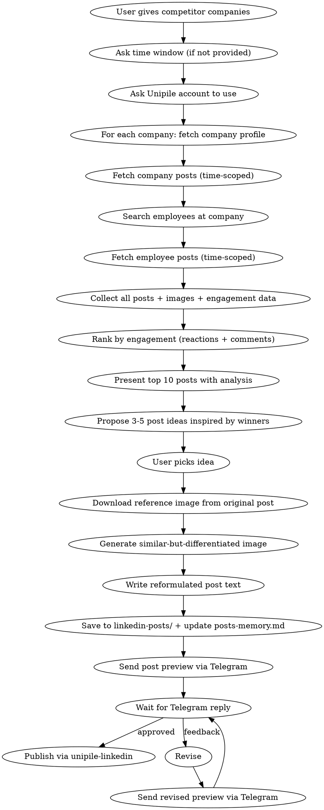

# LinkedIn Competitor Post Creator

Scrape LinkedIn posts from competitor companies and their employees, identify what's getting the most engagement, then generate inspired posts with reformulated text and visually similar (but differentiated) images.

## Prerequisites

- **unipile-linkedin** skill — for LinkedIn data collection (company posts, employee search, post scraping)
- **nanobanana-pro-fallback** skill — for image-to-image generation (creating visually similar but differentiated images)
- **openai-image-gen** skill — alternative image generation via OpenAI (text-to-image when no reference image)

## Workflow



## Step 0 — Gather Prerequisites (MANDATORY before anything else)

### 0a. Time Window (MANDATORY)

If the user did NOT provide a time window, **ASK immediately**. Do not proceed without one.

> "How far back should I scrape? (e.g. last 2 weeks, last 30 days, last 3 months)"

The time window determines how many posts to analyze. Without it, you'd pull everything from the beginning of time, which is impractical and wasteful.

Default: **last 30 days** if the user says something vague like "recent".

Calculate the cutoff date:
```
cutoff_date = now - time_window
```

Posts older than the cutoff are **ignored** during collection and analysis.

### 0b. Unipile Account (MANDATORY)

List connected accounts and ask the user which one to use:

```bash
node scripts/linkedin.mjs accounts
```

> Run all unipile commands from the skill directory: `/home/mohamed/.claude/skills/unipile-linkedin`

Present the list and ask:

> "Which LinkedIn account should I use for scraping? Here are your connected accounts:
> 1. [Account Name] (ID: xxx)
> 2. [Account Name] (ID: xxx)
> ..."

Store the selected `account_id` for all subsequent commands.

### 0c. Competitor Companies

The user provides one or more company names/identifiers. Accept them in any format:
- Company names: "Lemlist, Apollo, Outreach"
- LinkedIn URLs: "linkedin.com/company/lemlist"
- LinkedIn identifiers: "lemlist", "apollo-io"

Store all companies as a list. Process them ALL — do not ask the user to pick one.

## Step 1 — Scrape Competitor Company Posts

For **each** company in the list:

### 1a. Fetch Company Profile

```bash
node scripts/linkedin.mjs company <account_id> <company_identifier>
```

Extract and store:
- Company name, description, industry, size, followers
- The company's LinkedIn identifier (for post fetching)

### 1b. Fetch Company Posts (time-scoped)

```bash
node scripts/linkedin.mjs posts <account_id> <company_identifier> --company --limit=20
```

For each post, extract:
- **Text content** (full post body — keep the COMPLETE text, never truncate)
- **Image/media URLs** (if any)
- **Engagement metrics**: reactions count, comments count, shares count
- **Post date** — discard posts older than the cutoff date from Step 0b
- **Post ID** (for fetching detailed reactions/comments later)
- **Post URL / permalink** (the direct LinkedIn link to the post, e.g. `https://www.linkedin.com/feed/update/urn:li:activity:<id>`)
- **Post type** (text-only, image, video, carousel, article)

### 1c. Search for Employees at This Company

```bash
node scripts/linkedin.mjs search <account_id> --category=people --keywords="<company_name>" --limit=15
```

Filter results to people who actually work at the target company (check their headline/current position). Keep **up to 10 employees** (prioritize those with larger followings or leadership titles — marketing, growth, sales, founders first).

### 1d. Fetch Employee Posts (time-scoped)

For **each** of the up to 10 discovered employees:

```bash
node scripts/linkedin.mjs profile <account_id> <employee_identifier> '--sections=experience'
node scripts/linkedin.mjs posts <account_id> <employee_provider_id> --limit=10
```

Apply the same time-scoped filter: discard posts older than the cutoff date.

Extract the same data as 1b: text, images, engagement, date, type.

### IMPORTANT: Fetch from BOTH sources

You MUST fetch posts from **both**:
1. **The company page itself** (Step 1b) — these are the official company posts
2. **Up to 10 individual employees** (Steps 1c + 1d) — these are personal posts from people at the company

Both sources feed into the same analysis pool in Step 2. Do NOT skip either source. If the company page fetch fails (e.g. 422 error), still proceed with employee posts and note the failure.

### 1e. Cache Results

Save scraped data per company to avoid re-fetching:

```
linkedin-posts/competitors/<company_identifier>/
  company-profile.json     # Company metadata
  company-posts.json       # Company page posts with engagement
  employees.json           # Discovered employees list
  employee-posts.json      # All employee posts with engagement
  scraped_at: <ISO date>   # Cache timestamp
```

If cache exists and `scraped_at` is less than 24 hours old, reuse it.

## Step 2 — Analyze and Rank by Engagement

### 2a. Aggregate All Posts

Combine all posts from all companies (company pages + employees) into a single pool.

### 2b. Calculate Engagement Score

For each post, compute:

```
engagement_score = (reactions * 1) + (comments * 3) + (shares * 2)
```

Comments are weighted highest because they signal genuine interest and boost algorithmic reach.

### 2c. Rank and Select Top Performers

Sort all posts by `engagement_score` descending. Select the **top 10** posts.

### 2d. Download Original Images (NO generation yet)

For every top post that has an image:

1. **Download the original image** from the competitor's post
2. **Save it** in the competitor cache directory:
   ```
   linkedin-posts/competitors/<company>/images/
     <rank>-<author>-original.jpg
   ```

**DO NOT generate any differentiated images at this stage.** Image generation is expensive and only happens AFTER the user picks a post in Step 3. Present originals only.

### 2e. Present Analysis via Telegram — ONE message per post (originals only)

Send each top post as its **own separate Telegram message** so the user can scroll and reply to specific ones.

For each of the top 10 posts, send ONE Telegram message containing:

```
📊 *#<rank> — <post title/theme>*

👤 *Author:* <name> (<company>)
📅 *Date:* <date>
🔥 *Score:* <engagement_score> (💬 <comments> · ❤️ <reactions> · 🔁 <shares>)
🔗 *Link:* <direct LinkedIn post URL>

📝 *Full post text:*
<the COMPLETE original post text — never truncate or summarize>
```

If the post has an image, send it as a photo with the above as caption (use sendPhoto API). If caption exceeds Telegram's 1024-char limit for photos, send the photo first with a short caption, then send the full text as a follow-up message.

After ALL 10 posts are sent individually, send one final summary message:

```
📈 *Analysis Summary*

Top companies by engagement: ...
Key patterns: ...
Most effective post types: ...

Reply with a post number (e.g. "#3") to use it as inspiration, or describe what you want.
```

**ALWAYS wait for the user to pick a post (on Telegram) before proceeding to Step 3.**

## Step 3 — Propose Post Ideas (MANDATORY — wait for user pick)

Based on the top-performing posts from Step 2, propose **3-5 post ideas** that repurpose the winning concepts.

### How to Generate Ideas

For each idea, take a high-performing competitor post and:
- **Keep the core concept** that drove engagement (the topic, the hook pattern, the emotional trigger)
- **Change the point of view** (different angle, your author's perspective, contrarian take)
- **Reformulate the text** (same idea, completely different words and structure)
- **Note the reference post** so the user knows what inspired it

### Proposal Format

```
**#N — [Short title]**
Inspired by: [Company/Employee] post (Score: X) — "[first 50 chars of original]..."
Angle: [How this differs from the original]
Image strategy: [What the original image looked like + how we'll differentiate]
```

### Rules

- **ALWAYS wait for the user to pick** before proceeding
- Each idea must reference which competitor post inspired it
- The reformulation must be substantial enough to not be a copy, different enough to feel original
- If the user wants to combine elements from multiple competitor posts, that's fine
- Propose a mix: some that mirror the format exactly (different topic), some that take the opposite stance, some that expand on a subtopic

## Step 4 — Craft the Post Text

Take the selected idea from Step 3 and write the full post.

### Reformulation Rules

The goal: **same energy, same concept, completely different execution.**

| From the original | What you keep | What you change |
|---|---|---|
| Topic/theme | Keep it | Reframe from your author's perspective |
| Hook pattern | Keep the style (question, bold claim, story) | Write a new hook on the same topic |
| Structure | Keep what worked (short lines, bullets, story arc) | Rearrange, combine, split differently |
| Data/stats | Find different stats on the same topic | Use your own research (Step 4b) |
| CTA | Keep the engagement trigger type | Write a new question/prompt |
| Exact wording | NEVER copy | Reformulate entirely |

### 4a. Research (if needed)

If the inspired post references specific tools, stats, or trends:

1. `WebSearch` for current data on the same topic
2. Find your own supporting facts, different from the competitor's
3. Gather enough to write with authority

### 4b. Writing Guidelines

- Write in first person as the target author (use their voice from any cached profile data)
- If no author profile is cached, write in a professional but personable tone
- **NEVER use any type of dash in the post text.** No em dashes, en dashes, arrows, or hyphens used as separators. Replace with periods, commas, or line breaks. Hyphens inside compound words are fine.
- Keep the post length similar to the original's length (if it was short and punchy, stay short)
- Include 5-8 hashtags (mix: topic + industry + branded)

## Step 5 — Generate the Image (ONLY after user picks a post)

**Image generation is expensive. NEVER generate images speculatively. Only generate AFTER the user has:**
1. Picked a post idea from Step 3
2. Reviewed and approved (or tweaked) the post text from Step 4

### 5a. Send the Original Image + Text Draft via Telegram First

Before generating anything, send the user:
1. The **original competitor image** (already downloaded in Step 2d)
2. The **draft post text** from Step 4
3. Ask: "Ready for me to generate a differentiated image inspired by this original? Reply yes, or send tweaks."

**Wait for Telegram approval before spending on image generation.**

### 5b. Analyze the Original Image

Once approved, describe the competitor's original image in detail:
- Layout (split scene, single subject, infographic, screenshot, photo)
- Color palette (dominant colors, accent colors)
- Style (flat vector, 3D render, photograph, illustration, meme)
- Subject matter (person, product, abstract concept, data visualization)
- Composition (centered, rule of thirds, full bleed, whitespace-heavy)

### 5c. Create a Differentiated Image

The goal: **visually similar enough to trigger the same response, different enough to be original.**

Differentiation strategies:
- **Color shift**: Keep the layout but change the color palette (e.g. blue tones instead of green)
- **Angle change**: Same subject from a different perspective
- **Style swap**: Same concept but different artistic style (vector instead of photo, etc.)
- **Element swap**: Replace specific elements while keeping composition (different product, different icon set)
- **Complement**: Create the "other half" of the story the original told

### 5d. Generate with Image-to-Image (PREFERRED when reference image exists)

If you have the competitor's image, use nanobanana's image-to-image mode:

```bash
uv run /home/mohamed/.claude/skills/nanobanana-pro-fallback/scripts/generate_image.py \
  --prompt "<detailed description of desired changes: color shifts, angle changes, element swaps>" \
  --filename "linkedin-posts/YYYY-MM-DD-<slug>/image.png" \
  -i "linkedin-posts/competitors/<company>/images/<rank>-<author>-original.jpg" \
  --resolution 2K
```

### 5e. Generate with Text-to-Image (FALLBACK when no reference image)

If the competitor post had no image, or the image can't be downloaded:

**Option A — nanobanana (Gemini):**
```bash
uv run /home/mohamed/.claude/skills/nanobanana-pro-fallback/scripts/generate_image.py \
  --prompt "<detailed description based on Step 5b analysis>" \
  --filename "linkedin-posts/YYYY-MM-DD-<slug>/image.png" \
  --resolution 2K
```

**Option B — OpenAI Image Gen:**
```bash
python3 /home/mohamed/.claude/skills/openai-image-gen/scripts/gen.py \
  --prompt "<detailed description based on Step 5b analysis>" \
  --count 1 \
  --size 1536x1024 \
  --quality high \
  --out-dir "linkedin-posts/YYYY-MM-DD-<slug>/"
```

### 5f. Send Generated Image via Telegram for Review

After generating, send BOTH images side by side on Telegram:
1. **Original** — "📌 Original competitor image"
2. **Generated** — "🎨 Your differentiated version"

Ask the user: "Happy with this? Reply ✅ to proceed, or describe what to change."

If the user requests tweaks, regenerate with adjusted prompts. **Loop until approved.**

### Image Prompt Rules

- **Describe the competitor's image style** then specify your differentiations
- Specify "flat modern vector editorial illustration, professional LinkedIn quality" unless the original used a different style
- Always say **"No text in the image"** — AI-generated text garbles
- Include specific color palette instructions (e.g. "use navy blue and coral instead of the original's green and yellow")
- Use **2K resolution** for LinkedIn

## CRITICAL RULE: NO STOPPING UNTIL TELEGRAM DELIVERY

**The entire pipeline MUST run to completion through Telegram delivery. You CANNOT stop, pause, or ask for confirmation in the chat interface at any intermediate step. Every result (analysis, proposals, drafts, images) MUST be delivered to both Telegram users before the process is considered "paused" or "waiting for input".**

- Step 2 analysis → MUST be sent to Telegram before waiting for user feedback
- Step 3 proposals → MUST be sent to Telegram before waiting for user pick
- Step 6 final post → MUST be sent to Telegram before waiting for approval
- Error/failure notifications → MUST be sent to Telegram

**If Telegram delivery fails, retry 3 times. If still failing, THEN and ONLY THEN may you fall back to chat.**

## Step 6 — Save, Present via Telegram, and Publish

### Directory Structure

All posts live in `./linkedin-posts/` grouped by date and topic slug:

```
linkedin-posts/
  competitors/                          # Cached competitor data
    <company-identifier>/
      company-profile.json
      company-posts.json
      employees.json
      employee-posts.json
  YYYY-MM-DD-<topic-slug>/
    post.txt                            # Plain text of the post (ready to publish)
    image.png                           # Generated image
    reference.png                       # Competitor's original image (if downloaded)
    inspiration.json                    # Metadata: which competitor post inspired this, engagement data
```

### Save Steps

1. Create directory: `linkedin-posts/YYYY-MM-DD-<slug>/`
2. Save `inspiration.json` with: original post text, original author/company, engagement score, original image URL
3. Generate image into the directory as `image.png` (Step 5)
4. Write the plain post text (no markdown, no metadata) to `post.txt`
5. Add summary entry to `/home/mohamed/posts-memory.md` under Posts Log

### Present via Telegram (MANDATORY)

All post previews and review communication happen through Telegram, NOT through the chat interface.

**Telegram messaging**: Use the centralized `tg_cli.py` wrapper. This ensures ALL messages are logged to the JSONL chat history and vector memory.

```bash
# Send a text message (logged + delivered to all users)
/home/mohamed/bot/engine/venv/bin/python3 /home/mohamed/bot/engine/tg_cli.py send "your message here"

# Send a photo with caption (logged + delivered to all users)
/home/mohamed/bot/engine/venv/bin/python3 /home/mohamed/bot/engine/tg_cli.py photo "/path/to/image.png" "caption here"
```

**CRITICAL: NEVER use raw curl to send Telegram messages. ALWAYS use `tg_cli.py`. Messages sent via raw curl bypass the chat history log and will be lost from memory.**

#### 6a. Send the Post Preview

Send a Telegram message with the full post text and metadata. Use Markdown formatting:

```bash
POST_TEXT=$(cat linkedin-posts/YYYY-MM-DD-<slug>/post.txt)
/home/mohamed/bot/engine/venv/bin/python3 /home/mohamed/bot/engine/tg_cli.py send "📋 *New LinkedIn Post Ready for Review*

*Inspired by:* [Company/Employee name] (engagement score: X)

---

${POST_TEXT}

---

*Image:* Generated and saved locally.
Reply ✅ to approve and publish, or send feedback to revise."
```

To send the image:

```bash
/home/mohamed/bot/engine/venv/bin/python3 /home/mohamed/bot/engine/tg_cli.py photo "linkedin-posts/YYYY-MM-DD-<slug>/image.png" "Generated image for the post above"
```

#### 6b. Wait for Telegram Reply

The real-time Telegram bot handles replies automatically. When the user replies on Telegram, the bot picks it up and can route it to the next OpenCode run. No manual polling needed.

Simply send the preview via `tg_cli.py` and **end your response**. The user will reply on Telegram, which triggers the bot to run OpenCode again with their feedback.

Interpret the reply:
- **"✅"**, **"ok"**, **"yes"**, **"approve"**, **"publish"**, **"go"** → Proceed to publish
- **Any other text** → Treat as revision feedback. Apply the feedback, regenerate if needed, and send a new preview

#### 6c. NEVER Publish Without Telegram Approval

Both users receive the preview. Either one can approve or send feedback.

### Publishing (after Telegram approval)

> **CRITICAL: If the post has an image, you MUST post it WITH the image. If the image upload fails for any reason, ABORT. Do NOT fall back to text-only. Send a Telegram message explaining the failure and stop.**

> **IMAGE UPLOAD NOTE:** The Unipile SDK's `createPost` sends `Blob` without MIME type, which LinkedIn rejects (415). Use `curl` directly:

```bash
# Post WITH image (REQUIRED if post has an image) — use curl, NOT the SDK
curl -s -X POST "${UNIPILE_DSN}/api/v1/posts" \
  -H "X-API-KEY: ${UNIPILE_ACCESS_TOKEN}" \
  -F "account_id=<account_id>" \
  -F "text=</path/to/post.txt" \
  -F "attachments=@<image_path>;type=image/jpeg"

# For PNG images, convert to JPEG first (LinkedIn prefers JPEG):
# convert image.png -quality 95 image.jpg   (ImageMagick)
# Or: ffmpeg -i image.png -q:v 2 image.jpg

# Post text-only (ONLY if the post was designed without an image)
node scripts/linkedin.mjs create-post <account_id> "$(cat /path/to/post.txt)"
```

> Get `UNIPILE_DSN` and `UNIPILE_ACCESS_TOKEN` from `/home/mohamed/.claude/skills/unipile-linkedin/.env`

> **CRITICAL: NEVER inline post text in curl commands.** Always use curl's `<` file reference to read text from `post.txt`:
> ```bash
> -F "text=</path/to/post.txt"    # CORRECT
> -F 'text=Some post with "quotes"...'  # WRONG — shell escaping WILL break
> ```

### Post-Publish Notification

After successful publishing, notify both users via Telegram:

```bash
/home/mohamed/bot/engine/venv/bin/python3 /home/mohamed/bot/engine/tg_cli.py send "✅ *Post Published Successfully!*

The LinkedIn post has been published. Check it live on the account."
```

If publishing fails, notify with the error:

```bash
/home/mohamed/bot/engine/venv/bin/python3 /home/mohamed/bot/engine/tg_cli.py send "❌ *Publishing Failed*

Error: [error details]. The post is saved locally at linkedin-posts/YYYY-MM-DD-<slug>/. Please review and retry manually or reply with instructions."
```

## Posts Memory

All posts are logged in `/home/mohamed/posts-memory.md` with: platform, author, angle, key points, file path (`linkedin-posts/YYYY-MM-DD-<slug>/`), inspired-by (competitor + post reference), and status.
